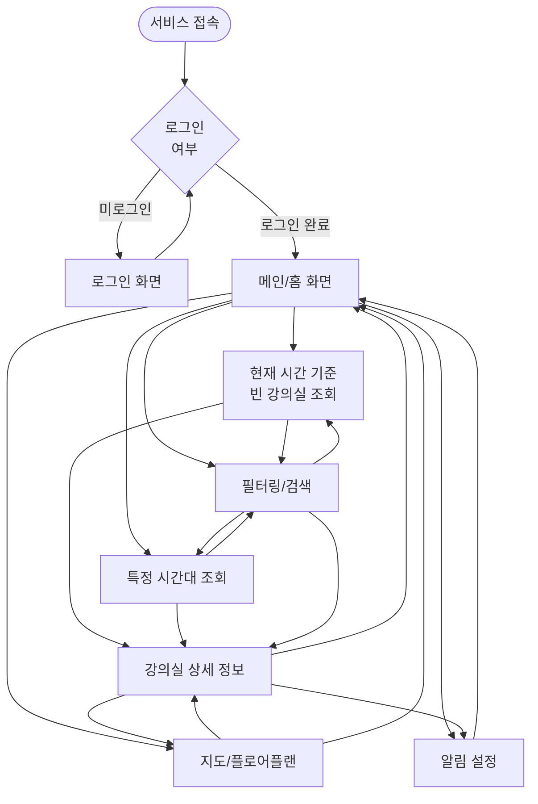

# 서울여자대학교 빈 강의실 현황 실시간 알리미 - 와이어프레임

## 목차

1. [메인/홈 화면](#1-메인홈-화면)
2. [현재 시간 기준 빈 강의실 조회 화면](#2-현재-시간-기준-빈-강의실-조회-화면)
3. [특정 시간대 조회 화면](#3-특정-시간대-조회-화면)
4. [필터링/검색 화면](#4-필터링검색-화면)
5. [강의실 상세 정보 화면](#5-강의실-상세-정보-화면)
6. [지도/플로어플랜 뷰](#6-지도플로어플랜-뷰)
7. [알림 설정 화면](#7-알림-설정-화면)
8. [로그인/인증 화면](#8-로그인인증-화면)
9. [사용자 플로우](#9-사용자-플로우)

---

## 색상 코드 및 상태 표시

### 강의실 상태 색상
- **녹색 배경 (#90EE90)**: 빈 강의실 (현재 사용 가능)
- **빨간색 배경 (#FF6B6B)**: 수업 진행 중 (현재 사용 불가)
- **노란색 배경 (#FFD93D)**: 곧 사용 예정 (10분 이내 수업 시작)

### 레이아웃 표기법
- `[텍스트]`: 버튼/클릭 가능한 요소
- `|텍스트|`: 입력 필드
- `{텍스트}`: 아이콘/이미지
- `===`: 구분선
- `---`: 섹션 구분

---

## 1. 메인/홈 화면

### 목적
서비스 소개 및 주요 기능 접근을 제공하는 첫 화면

### 레이아웃 구조

```
┌─────────────────────────────────────────────────────────────┐
│ [로고] 서울여자대학교 빈 강의실 알리미    [로그인] [메뉴]     │ 헤더
├─────────────────────────────────────────────────────────────┤
│                                                               │
│              서울여자대학교 빈 강의실 현황                    │
│                   실시간 알리미                              │
│                                                               │
│         실시간으로 빈 강의실을 확인하여                       │
│         자습 공간을 쉽게 찾아보세요                          │
│                                                               │
│  ┌──────────────────────┐  ┌──────────────────────┐         │
│  │                      │  │                      │         │
│  │  현재 시간 기준      │  │  특정 시간대 조회    │         │
│  │  빈 강의실 조회      │  │                      │         │
│  │                      │  │                      │         │
│  │  [지금 찾기]         │  │  [시간 선택하기]     │         │
│  │                      │  │                      │         │
│  └──────────────────────┘  └──────────────────────┘         │
│                                                               │
│  ┌──────────────────────────────────────────────────┐      │
│  │                                                    │      │
│  │  주요 기능                                        │      │
│  │  • 실시간 강의실 현황 확인                        │      │
│  │  • 시간대별 빈 강의실 조회                        │      │
│  │  • 고급 필터링 및 검색                            │      │
│  │  • 지도/플로어플랜 뷰                             │      │
│  │  • 알림 기능                                      │      │
│  │                                                    │      │
│  └──────────────────────────────────────────────────┘      │
│                                                               │
├─────────────────────────────────────────────────────────────┤
│ 서울여자대학교 | 문의: support@swu.ac.kr | 버전 1.0         │ 푸터
└─────────────────────────────────────────────────────────────┘
```

### 주요 컴포넌트
- **헤더**: 로고, 로그인 버튼, 메뉴 아이콘
- **메인 영역**: 서비스 소개, 주요 기능 카드 2개
- **푸터**: 학교 정보, 문의처, 버전 정보

### 모바일 반응형
- 카드 레이아웃이 세로로 배치
- 터치 친화적인 버튼 크기

---

## 2. 현재 시간 기준 빈 강의실 조회 화면

### 목적
현재 시각을 기준으로 즉시 사용 가능한 빈 강의실 목록 제공

### 레이아웃 구조

```
┌─────────────────────────────────────────────────────────────┐
│ [←] 현재 시간 기준 빈 강의실 조회        [검색] [필터] [지도]│ 헤더
├─────────────────────────────────────────────────────────────┤
│                                                               │
│  현재 시간: 2024년 3월 11일 (월) 14:30                       │
│  ┌─────────────────────────────────────────────────────┐   │
│  │ |강의실 번호 또는 건물명 검색...|  {검색 아이콘}     │   │ 검색바
│  └─────────────────────────────────────────────────────┘   │
│                                                               │
│  [전체] [본관] [인문관] [자연관]  [1층] [2층] [3층]         │ 필터 탭
│  ───────────────────────────────────────────────────────     │
│                                                               │
│  ┌─────────────────────────────────────────────────────┐   │
│  │ [녹색 배경] 본관 101호                              │   │
│  │ 수용 인원: 30명 | 현재 인원: 0/30명                 │   │
│  │ 다음 수업: 16:00 (1시간 30분 남음)                 │   │
│  │ [상세보기] [지도보기] [즐겨찾기]                    │   │
│  └─────────────────────────────────────────────────────┘   │
│                                                               │
│  ┌─────────────────────────────────────────────────────┐   │
│  │ [녹색 배경] 본관 201호                              │   │
│  │ 수용 인원: 50명 | 현재 인원: 0/50명                 │   │
│  │ 다음 수업: 없음 (오늘 종일 사용 가능)               │   │
│  │ [상세보기] [지도보기] [즐겨찾기]                    │   │
│  └─────────────────────────────────────────────────────┘   │
│                                                               │
│  ┌─────────────────────────────────────────────────────┐   │
│  │ [녹색 배경] 인문관 101호                            │   │
│  │ 수용 인원: 40명 | 현재 인원: 0/40명                 │   │
│  │ 다음 수업: 15:00 (30분 남음)                        │   │
│  │ [상세보기] [지도보기] [즐겨찾기]                    │   │
│  └─────────────────────────────────────────────────────┘   │
│                                                               │
│  ┌─────────────────────────────────────────────────────┐   │
│  │ [빨간색 배경] 본관 301호                            │   │
│  │ 수용 인원: 80명 | 현재 인원: 45/80명                │   │
│  │ 수업 진행 중: "컴퓨터 활용" (13:00~14:00)           │   │
│  │ 수업 종료: 14:00 (30분 후)                          │   │
│  │ [상세보기] [지도보기] [즐겨찾기]                    │   │
│  └─────────────────────────────────────────────────────┘   │
│                                                               │
│  ┌─────────────────────────────────────────────────────┐   │
│  │ [노란색 배경] 자연관 201호                          │   │
│  │ 수용 인원: 50명 | 현재 인원: 0/50명                 │   │
│  │ 다음 수업: 14:40 (10분 후 시작 예정)                │   │
│  │ [상세보기] [지도보기] [즐겨찾기]                    │   │
│  └─────────────────────────────────────────────────────┘   │
│                                                               │
│  총 12개의 빈 강의실 발견                                    │ 결과 요약
│                                                               │
└─────────────────────────────────────────────────────────────┘
```

### 주요 컴포넌트
- **헤더**: 뒤로가기, 화면 제목, 검색/필터/지도 버튼
- **현재 시간 표시**: 날짜 및 시간 정보
- **검색바**: 강의실 번호 또는 건물명 검색
- **필터 탭**: 건물별, 층수별 빠른 필터링
- **강의실 카드**: 상태별 색상 배경, 기본 정보, 액션 버튼
- **결과 요약**: 조회된 강의실 개수

### 상태별 카드 표시
- **녹색 배경**: 빈 강의실 - 다음 수업 시간 표시
- **빨간색 배경**: 수업 진행 중 - 현재 수업명 및 종료 시간
- **노란색 배경**: 곧 사용 예정 - 다음 수업 시작 시간 강조

### 모바일 반응형
- 카드가 전체 너비로 표시
- 필터 탭이 스크롤 가능한 가로 스크롤
- 하단 고정 버튼: [지도보기], [필터]

---

## 3. 특정 시간대 조회 화면

### 목적
사용자가 원하는 날짜와 시간대를 선택하여 해당 시간에 빈 강의실 조회

### 레이아웃 구조

```
┌─────────────────────────────────────────────────────────────┐
│ [←] 특정 시간대 조회              [검색] [필터] [지도]      │ 헤더
├─────────────────────────────────────────────────────────────┤
│                                                               │
│  ┌─────────────────────────────────────────────────────┐   │
│  │ 날짜 선택                                            │   │
│  │ [오늘] [내일] [모레] [날짜 선택]                    │   │
│  │ 선택된 날짜: 2024년 3월 12일 (화)                   │   │
│  └─────────────────────────────────────────────────────┘   │
│                                                               │
│  ┌─────────────────────────────────────────────────────┐   │
│  │ 시간대 선택                                          │   │
│  │ 시작 시간: |14:00|  종료 시간: |16:00|              │   │
│  │                                                       │   │
│  │ 빠른 선택:                                           │   │
│  │ [오전 (09:00-12:00)] [오후 (13:00-17:00)]           │   │
│  │ [저녁 (17:00-19:00)] [종일 (09:00-19:00)]           │   │
│  └─────────────────────────────────────────────────────┘   │
│                                                               │
│  [조회하기]                                                  │ 조회 버튼
│                                                               │
│  ───────────────────────────────────────────────────────    │
│                                                               │
│  선택한 시간대: 2024년 3월 12일 (화) 14:00 ~ 16:00           │ 결과 헤더
│                                                               │
│  ┌─────────────────────────────────────────────────────┐   │
│  │ [녹색 배경] 본관 101호                              │   │
│  │ 수용 인원: 30명                                      │   │
│  │ 14:00~16:00 사용 가능                                │   │
│  │ [상세보기] [지도보기] [즐겨찾기]                    │   │
│  └─────────────────────────────────────────────────────┘   │
│                                                               │
│  ┌─────────────────────────────────────────────────────┐   │
│  │ [녹색 배경] 본관 201호                              │   │
│  │ 수용 인원: 50명                                      │   │
│  │ 14:00~16:00 사용 가능                                │   │
│  │ [상세보기] [지도보기] [즐겨찾기]                    │   │
│  └─────────────────────────────────────────────────────┘   │
│                                                               │
│  ┌─────────────────────────────────────────────────────┐   │
│  │ [녹색 배경] 인문관 101호                            │   │
│  │ 수용 인원: 40명                                      │   │
│  │ 14:00~15:00 사용 가능 (15:00 이후 수업 있음)        │   │
│  │ [상세보기] [지도보기] [즐겨찾기]                    │   │
│  └─────────────────────────────────────────────────────┘   │
│                                                               │
│  총 8개의 강의실이 선택한 시간대에 사용 가능                 │ 결과 요약
│                                                               │
└─────────────────────────────────────────────────────────────┘
```

### 주요 컴포넌트
- **날짜 선택 영역**: 오늘/내일/모레 빠른 선택, 달력 선택
- **시간대 선택 영역**: 시작/종료 시간 입력, 빠른 선택 버튼
- **조회 버튼**: 선택한 조건으로 조회 실행
- **결과 영역**: 선택한 시간대에 사용 가능한 강의실 목록

### 모바일 반응형
- 날짜 선택이 가로 스크롤 가능한 탭 형태
- 시간 입력이 드롭다운 또는 시간 피커로 표시
- 조회 버튼이 하단 고정

---

## 4. 필터링/검색 화면

### 목적
고급 필터 옵션을 제공하여 사용자가 원하는 조건에 맞는 강의실 검색

### 레이아웃 구조

```
┌─────────────────────────────────────────────────────────────┐
│ [←] 필터 및 검색                      [초기화] [적용]        │ 헤더
├─────────────────────────────────────────────────────────────┤
│                                                               │
│  ┌─────────────────────────────────────────────────────┐   │
│  │ 검색                                                 │   │
│  │ |강의실 번호 또는 건물명 검색...|  {검색 아이콘}     │   │
│  └─────────────────────────────────────────────────────┘   │
│                                                               │
│  ┌─────────────────────────────────────────────────────┐   │
│  │ 건물 선택                                            │   │
│  │ ☑ 전체  ☐ 본관  ☐ 인문관  ☐ 자연관                  │   │
│  └─────────────────────────────────────────────────────┘   │
│                                                               │
│  ┌─────────────────────────────────────────────────────┐   │
│  │ 층수 선택                                            │   │
│  │ ☑ 전체  ☐ 1층  ☐ 2층  ☐ 3층                          │   │
│  └─────────────────────────────────────────────────────┘   │
│                                                               │
│  ┌─────────────────────────────────────────────────────┐   │
│  │ 수용 인원                                            │   │
│  │ 최소: |5|명  최대: |100|명                            │   │
│  │ [슬라이더: 5 ─────●────── 100]                        │   │
│  └─────────────────────────────────────────────────────┘   │
│                                                               │
│  ┌─────────────────────────────────────────────────────┐   │
│  │ 시설                                                 │   │
│  │ ☐ 프로젝터  ☐ 화이트보드  ☐ 컴퓨터                   │   │
│  │ ☐ 마이크/스피커  ☐ 에어컨/난방  ☐ 조명               │   │
│  └─────────────────────────────────────────────────────┘   │
│                                                               │
│  ┌─────────────────────────────────────────────────────┐   │
│  │ 접근성                                               │   │
│  │ ☐ 휠체어 접근 가능  ☐ 엘리베이터 이용 가능           │   │
│  │ ☐ 장애인 화장실  ☐ 시각 장애인 지원                  │   │
│  └─────────────────────────────────────────────────────┘   │
│                                                               │
│  ┌─────────────────────────────────────────────────────┐   │
│  │ 강의실 상태                                          │   │
│  │ ☑ 빈 강의실  ☑ 수업 진행 중  ☑ 곧 사용 예정         │   │
│  └─────────────────────────────────────────────────────┘   │
│                                                               │
│  [초기화]                                    [필터 적용하기] │ 액션 버튼
│                                                               │
└─────────────────────────────────────────────────────────────┘
```

### 주요 컴포넌트
- **검색바**: 강의실 번호 또는 건물명 검색
- **건물 선택**: 체크박스로 건물 선택
- **층수 선택**: 체크박스로 층수 선택
- **수용 인원**: 최소/최대 인원 입력 또는 슬라이더
- **시설 필터**: 체크박스로 시설 선택
- **접근성 필터**: 체크박스로 접근성 옵션 선택
- **강의실 상태**: 상태별 필터링 옵션
- **액션 버튼**: 초기화 및 필터 적용

### 모바일 반응형
- 각 필터 섹션이 아코디언 형태로 접기/펼치기 가능
- 슬라이더가 터치 친화적으로 조정
- 하단 고정 버튼: [초기화], [필터 적용하기]

---

## 5. 강의실 상세 정보 화면

### 목적
개별 강의실의 상세 정보를 제공 (기본 정보, 시설, 접근성, 시간표 등)

### 레이아웃 구조

```
┌─────────────────────────────────────────────────────────────┐
│ [←] 본관 101호                    [즐겨찾기] [공유] [신고]   │ 헤더
├─────────────────────────────────────────────────────────────┤
│                                                               │
│  ┌─────────────────────────────────────────────────────┐   │
│  │ [녹색 배경] 본관 101호                              │   │
│  │ 현재 상태: 빈 강의실 (사용 가능)                     │   │
│  │ 다음 수업: 16:00 (1시간 30분 남음)                  │   │
│  └─────────────────────────────────────────────────────┘   │
│                                                               │
│  ┌─────────────────────────────────────────────────────┐   │
│  │ 기본 정보                                            │   │
│  │ • 건물: 본관 (Main Building)                          │   │
│  │ • 강의실 번호: 101호                                  │   │
│  │ • 층수: 1층                                           │   │
│  │ • 수용 인원: 30명                                     │   │
│  │ • 현재 인원: 0/30명                                   │   │
│  └─────────────────────────────────────────────────────┘   │
│                                                               │
│  ┌─────────────────────────────────────────────────────┐   │
│  │ 시설 정보                                            │   │
│  │ ✓ 프로젝터  ✓ 화이트보드  ✓ 컴퓨터                   │   │
│  │ ✓ 마이크/스피커  ✓ 에어컨/난방  ✓ 조명               │   │
│  └─────────────────────────────────────────────────────┘   │
│                                                               │
│  ┌─────────────────────────────────────────────────────┐   │
│  │ 접근성 정보                                          │   │
│  │ ✓ 휠체어 접근 가능  ✓ 엘리베이터 이용 가능           │   │
│  │ ✓ 장애인 화장실                                      │   │
│  └─────────────────────────────────────────────────────┘   │
│                                                               │
│  ┌─────────────────────────────────────────────────────┐   │
│  │ 오늘의 시간표 (2024년 3월 11일 월요일)               │   │
│  │                                                       │   │
│  │ 09:00-10:00  [녹색] 빈 강의실                        │   │
│  │ 10:00-11:00  [녹색] 빈 강의실                        │   │
│  │ 11:00-12:00  [빨간색] 영어회화 기초                  │   │
│  │ 12:00-13:00  [녹색] 빈 강의실                        │   │
│  │ 13:00-14:00  [빨간색] 컴퓨터 활용                    │   │
│  │ 14:00-15:00  [녹색] 빈 강의실                        │   │
│  │ 15:00-16:00  [녹색] 빈 강의실                        │   │
│  │ 16:00-17:00  [빨간색] 문학과 사회                    │   │
│  │                                                       │   │
│  │ [이전 날짜] [다음 날짜] [전체 주간 보기]             │   │
│  └─────────────────────────────────────────────────────┘   │
│                                                               │
│  [지도에서 보기]  [플로어플랜 보기]  [알림 설정하기]         │ 액션 버튼
│                                                               │
└─────────────────────────────────────────────────────────────┘
```

### 주요 컴포넌트
- **상태 헤더**: 강의실 번호, 현재 상태, 다음 수업 정보
- **기본 정보 섹션**: 건물, 강의실 번호, 층수, 수용 인원
- **시설 정보 섹션**: 시설 목록 (체크마크 표시)
- **접근성 정보 섹션**: 접근성 옵션 (체크마크 표시)
- **시간표 섹션**: 오늘의 시간표, 날짜 네비게이션
- **액션 버튼**: 지도, 플로어플랜, 알림 설정

### 모바일 반응형
- 각 섹션이 세로로 스크롤 가능
- 시간표가 가로 스크롤 가능한 타임라인 형태
- 하단 고정 버튼: [지도에서 보기], [플로어플랜 보기]

---

## 6. 지도/플로어플랜 뷰

### 목적
캠퍼스 지도와 건물 내부 플로어플랜을 통해 강의실 위치를 시각적으로 확인

### 6.1 캠퍼스 지도 뷰

```
┌─────────────────────────────────────────────────────────────┐
│ [←] 캠퍼스 지도                    [목록보기] [현재 위치]   │ 헤더
├─────────────────────────────────────────────────────────────┤
│                                                               │
│  [전체] [본관] [인문관] [자연관]                             │ 건물 필터
│  ───────────────────────────────────────────────────────    │
│                                                               │
│  ┌─────────────────────────────────────────────────────┐   │
│  │                                                     │   │
│  │              [본관]                                 │   │
│  │              (녹색: 5개 빈 강의실)                 │   │
│  │                                                     │   │
│  │    [인문관]              [자연관]                  │   │
│  │    (녹색: 3개)            (녹색: 4개)              │   │
│  │                                                     │   │
│  │                                                     │   │
│  │                                                     │   │
│  │                                                     │   │
│  │                                                     │   │
│  │                                                     │   │
│  │                                                     │   │
│  │                                                     │   │
│  │                                                     │   │
│  └─────────────────────────────────────────────────────┘   │
│                                                               │
│  범례:                                                       │
│  [녹색] 빈 강의실  [빨간색] 수업 진행 중  [노란색] 곧 사용 예정│
│                                                               │
│  [확대] [축소] [현재 위치로 이동]                            │ 지도 컨트롤
│                                                               │
└─────────────────────────────────────────────────────────────┘
```

### 6.2 건물 내부 플로어플랜 뷰

```
┌─────────────────────────────────────────────────────────────┐
│ [←] 본관 플로어플랜              [1층] [2층] [3층] [목록]   │ 헤더
├─────────────────────────────────────────────────────────────┤
│                                                               │
│  현재 층: 1층                                                 │
│  ───────────────────────────────────────────────────────    │
│                                                               │
│  ┌─────────────────────────────────────────────────────┐   │
│  │                                                     │   │
│  │  ┌─────┐  ┌─────┐  ┌─────┐  ┌─────┐              │   │
│  │  │101호│  │102호│  │103호│  │104호│              │   │
│  │  │녹색 │  │녹색 │  │빨강 │  │녹색 │              │   │
│  │  └─────┘  └─────┘  └─────┘  └─────┘              │   │
│  │                                                     │   │
│  │  ┌─────┐  ┌─────┐  ┌─────┐  ┌─────┐              │   │
│  │  │105호│  │106호│  │107호│  │108호│              │   │
│  │  │녹색 │  │노랑 │  │녹색 │  │녹색 │              │   │
│  │  └─────┘  └─────┘  └─────┘  └─────┘              │   │
│  │                                                     │   │
│  │  [계단]              [엘리베이터]                   │   │
│  │                                                     │   │
│  └─────────────────────────────────────────────────────┘   │
│                                                               │
│  범례:                                                       │
│  [녹색] 빈 강의실  [빨간색] 수업 진행 중  [노란색] 곧 사용 예정│
│                                                               │
│  [확대] [축소] [전체 보기]                                    │ 플로어플랜 컨트롤
│                                                               │
└─────────────────────────────────────────────────────────────┘
```

### 주요 컴포넌트
- **캠퍼스 지도**: 건물 위치 표시, 상태별 색상 표시
- **건물 필터**: 특정 건물만 표시
- **플로어플랜**: 층별 강의실 배치도, 상태별 색상 표시
- **층 선택**: 층별 전환
- **범례**: 색상별 상태 설명
- **지도 컨트롤**: 확대/축소, 현재 위치

### 모바일 반응형
- 지도가 전체 화면으로 표시
- 핀치 줌 지원
- 하단 시트로 강의실 목록 표시

---

## 7. 알림 설정 화면

### 목적
관심 강의실에 대한 알림 설정 및 관리

### 레이아웃 구조

```
┌─────────────────────────────────────────────────────────────┐
│ [←] 알림 설정                                              │ 헤더
├─────────────────────────────────────────────────────────────┤
│                                                               │
│  ┌─────────────────────────────────────────────────────┐   │
│  │ 알림 설정                                            │   │
│  │                                                       │   │
│  │ 푸시 알림 받기                                       │   │
│  │ [ON/OFF 토글]                                        │   │
│  │                                                       │   │
│  │ 알림 받을 시간대                                     │   │
│  │ |09:00| ~ |19:00|                                    │   │
│  │                                                       │   │
│  │ 알림 유형                                            │   │
│  │ ☑ 관심 강의실이 비면 즉시 알림                       │   │
│  │ ☑ 특정 시간대에 빈 강의실이 생기면 알림              │   │
│  │ ☐ 현재 사용 중인 강의실의 수업 종료 시간 알림       │   │
│  └─────────────────────────────────────────────────────┘   │
│                                                               │
│  ┌─────────────────────────────────────────────────────┐   │
│  │ 관심 강의실 목록                                    │   │
│  │                                                       │   │
│  │ ┌───────────────────────────────────────────────┐   │   │
│  │ │ 본관 101호                          [알림 ON]  │   │   │
│  │ │ 다음 수업: 16:00                                │   │   │
│  │ │ [상세보기] [삭제]                               │   │   │
│  │ └───────────────────────────────────────────────┘   │   │
│  │                                                       │   │
│  │ ┌───────────────────────────────────────────────┐   │   │
│  │ │ 본관 201호                          [알림 ON]  │   │   │
│  │ │ 다음 수업: 없음                                │   │   │
│  │ │ [상세보기] [삭제]                               │   │   │
│  │ └───────────────────────────────────────────────┘   │   │
│  │                                                       │   │
│  │ [+ 관심 강의실 추가하기]                            │   │
│  └─────────────────────────────────────────────────────┘   │
│                                                               │
│  [저장하기]                                                  │ 저장 버튼
│                                                               │
└─────────────────────────────────────────────────────────────┘
```

### 주요 컴포넌트
- **알림 설정 섹션**: 푸시 알림 ON/OFF, 알림 시간대, 알림 유형
- **관심 강의실 목록**: 알림을 받을 강의실 목록, 개별 ON/OFF
- **액션**: 관심 강의실 추가, 삭제, 저장

### 모바일 반응형
- 토글이 터치 친화적으로 조정
- 관심 강의실 카드가 스와이프로 삭제 가능
- 하단 고정 버튼: [저장하기]

---

## 8. 로그인/인증 화면

### 목적
서울여자대학교 포털 계정(SSO)을 통한 로그인 및 인증

### 레이아웃 구조

```
┌─────────────────────────────────────────────────────────────┐
│                                                               │
│                                                               │
│              서울여자대학교                                   │
│              빈 강의실 현황 실시간 알리미                     │
│                                                               │
│  ┌─────────────────────────────────────────────────────┐   │
│  │                                                     │   │
│  │  서울여자대학교 포털 계정으로                        │   │
│  │  로그인하세요                                       │   │
│  │                                                     │   │
│  │  [서울여자대학교 포털 로그인]                        │   │
│  │                                                     │   │
│  │  또는                                               │   │
│  │                                                     │   │
│  │  |학번 또는 이메일|                                  │   │
│  │  |비밀번호|                                         │   │
│  │                                                     │   │
│  │  ☐ 로그인 상태 유지                                 │   │
│  │                                                     │   │
│  │  [로그인]                                           │   │
│  │                                                     │   │
│  │  [비밀번호 찾기]                                    │   │
│  │                                                     │   │
│  └─────────────────────────────────────────────────────┘   │
│                                                               │
│  서울여자대학교 재학생만 이용 가능합니다                     │ 안내 문구
│                                                               │
│                                                               │
└─────────────────────────────────────────────────────────────┘
```

### 주요 컴포넌트
- **서비스 로고/제목**: 서비스명 표시
- **SSO 로그인 버튼**: 포털 계정 연동 로그인
- **일반 로그인 폼**: 학번/이메일, 비밀번호 입력
- **옵션**: 로그인 상태 유지 체크박스
- **링크**: 비밀번호 찾기

### 모바일 반응형
- 로그인 폼이 중앙 정렬
- SSO 버튼이 주요 액션으로 강조
- 키보드 입력 시 화면 자동 조정

---

## 9. 사용자 플로우

### 9.1 전체 사용자 플로우 다이어그램



### 9.2 주요 사용 시나리오별 플로우

#### 시나리오 1: 현재 시간 기준 빈 강의실 찾기
```
메인 화면
  ↓
[현재 시간 기준 빈 강의실 조회] 클릭
  ↓
현재 시간 기준 빈 강의실 조회 화면
  ↓
강의실 목록 확인
  ↓
[필터] 또는 [검색] 사용 (선택)
  ↓
원하는 강의실 선택
  ↓
강의실 상세 정보 화면
  ↓
[지도보기] 또는 [플로어플랜 보기] (선택)
  ↓
강의실로 이동
```

#### 시나리오 2: 특정 시간대 조회
```
메인 화면
  ↓
[특정 시간대 조회] 클릭
  ↓
특정 시간대 조회 화면
  ↓
날짜 선택
  ↓
시간대 선택
  ↓
[조회하기] 클릭
  ↓
결과 목록 확인
  ↓
강의실 상세 정보 화면
```

#### 시나리오 3: 필터링을 활용한 강의실 찾기
```
메인 화면 또는 조회 화면
  ↓
[필터] 클릭
  ↓
필터링/검색 화면
  ↓
필터 조건 설정
  - 건물 선택
  - 층수 선택
  - 수용 인원
  - 시설
  - 접근성
  ↓
[필터 적용하기] 클릭
  ↓
필터링된 결과 목록
  ↓
강의실 상세 정보 화면
```

### 9.3 화면 간 네비게이션 관계

```
메인 화면 (중앙 허브)
  ├─→ 현재 시간 기준 조회
  │     ├─→ 필터링/검색
  │     ├─→ 지도/플로어플랜
  │     └─→ 강의실 상세 정보
  │           ├─→ 지도/플로어플랜
  │           └─→ 알림 설정
  │
  ├─→ 특정 시간대 조회
  │     ├─→ 필터링/검색
  │     ├─→ 지도/플로어플랜
  │     └─→ 강의실 상세 정보
  │
  ├─→ 지도/플로어플랜
  │     └─→ 강의실 상세 정보
  │
  └─→ 알림 설정
        └─→ 강의실 상세 정보
```

---

## 반응형 디자인 가이드

### 데스크톱 (1920px 이상)
- 3단 레이아웃 (사이드바, 메인 콘텐츠, 사이드바)
- 카드 그리드: 3-4열
- 필터가 좌측 사이드바에 고정

### 태블릿 (768px ~ 1919px)
- 2단 레이아웃 (사이드바, 메인 콘텐츠)
- 카드 그리드: 2열
- 필터가 접을 수 있는 사이드바

### 모바일 (767px 이하)
- 1단 레이아웃 (전체 너비)
- 카드 그리드: 1열
- 필터가 하단 시트 또는 모달로 표시
- 하단 네비게이션 바 고정

---

## UI 컴포넌트 명세

### 버튼
- **주요 액션**: 파란색 배경, 흰색 텍스트, 48px 높이
- **보조 액션**: 흰색 배경, 파란색 테두리, 40px 높이
- **텍스트 링크**: 파란색 텍스트, 밑줄 없음

### 입력 필드
- **텍스트 입력**: 40px 높이, 둥근 모서리, 포커스 시 파란색 테두리
- **드롭다운**: 40px 높이, 화살표 아이콘
- **체크박스/라디오**: 24px 크기, 파란색 체크

### 카드
- **강의실 카드**: 흰색 배경, 그림자 효과, 상태별 색상 배경
- **정보 카드**: 흰색 배경, 둥근 모서리, 패딩 16px

### 색상 팔레트
- **주 색상**: 파란색 (#2563EB)
- **성공/빈 강의실**: 녹색 (#90EE90)
- **경고/곧 사용 예정**: 노란색 (#FFD93D)
- **에러/수업 진행 중**: 빨간색 (#FF6B6B)
- **텍스트**: 검은색 (#1F2937), 회색 (#6B7280)

---

**문서 작성일**: 2024년  
**버전**: 1.0  
**작성 목적**: 서비스 화면 구조 및 레이아웃 설계  
**참고 문서**: [서비스 기획안](service-plan.md)
